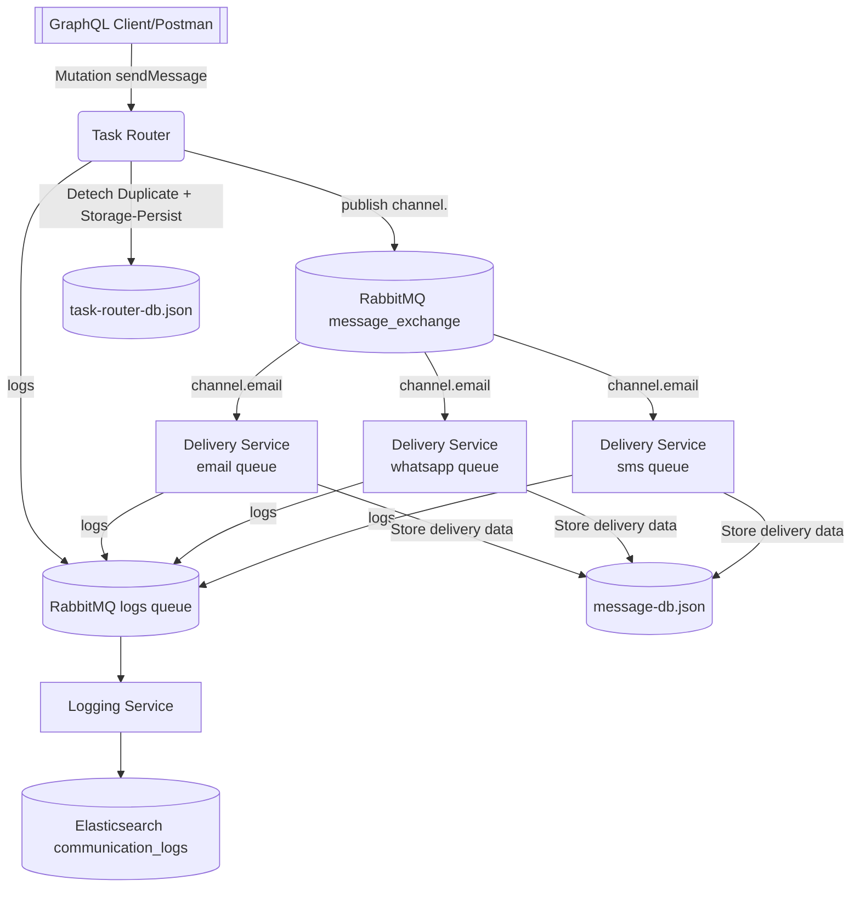

# Communication Aggregator System

This repository contains the implementation for a three-service communication aggregator:
 - **Task Router** GraphQL API routing
 - **Delivery Service** that fans out work across channels
 - **Logging Service** that centralizes observability in Elasticsearch.

---

## Architecture Overview

- **Task Router (`task-router`)** receives GraphQL `sendMessage` mutations, persists deduplicated intents to LowDB (`db/data/task-router-db.json`), and publishes payloads to a RabbitMQ topic exchange (`message_exchange`).
- **Delivery Service (`delivery-service`)** subscribes to channel-specific queues, calls mocked channel adapters (`services/email|sms|whatsapp.js`), persists deliveries to `db/data/message-db.json`, and emits structured log events.
- **Logging Service (`logging-service`)** consumes the `logs` queue, send them into Elasticsearch (`communication_logs` index).
- **Shared Infrastructure** includes RabbitMQ, Elasticsearch (observability), and file-based LowDB instances that make the state visible without installing a heavyweight RDBMS.



### Data Flow

1.  **Client → Task Router**: GraphQL mutation arrives with `channel`, `to`, and `body`. Router assigns `messageId` + `traceId`, detectduplicates, and stores it.
2.  **Task Router → RabbitMQ**: Router publishes the payload to `message_exchange` using routing key `channel.<type>`.
3.  **RabbitMQ → Delivery Service**: The delivery worker consumes `email_queue`, `sms_queue`, or `whatsapp_queue`, invokes the corresponding handler/adapter , and delivery record.
4.  **Delivery Service → RabbitMQ Logs Queue**: Event logs are sent to the durable `logs` queue.
5.  **Logging Service → Elasticsearch**: The logger indexes every log document into `communication_logs` for querying in Kibana or via the REST API.

---

## Running the Stack

### 1. Via Docker Compose (recommended)

```bash
docker compose up -d
```

This brings up RabbitMQ (ports `5672/15672`), Elasticsearch (`9200/9300`), and all three Node.js services. LowDB volumes are mounted so data survives container restarts.

> **Elastic credentials**: create `.env` in all services and populate those with correct variables (see Step-2 to configure env variables). For local testing we can use the default `elastic` user created by the official image.

### 2. Run services individually or local/host system

Each service uses `npm` scripts; run them in separate terminals after exporting the env vars shown.

```bash
# RabbitMQ & Elasticsearch must already be running (compose or local installs)

# Task Router (GraphQL on :4000)
cd task-router
npm install
RABBITMQ_URL=amqp://localhost:5672 PORT=4000 DB_DIR=../db/data npm run start
# For docker to run with correct variable replace localhost to container name(you can check conatiner name in docker-compose.yml file) lie below:
# RABBITMQ_URL=amqp://rabbitmq:5672
# Delivery Service workers
cd delivery-service
npm install
RABBITMQ_URL=amqp://localhost DB_DIR=../db/data npm run start

# Logging Service
cd logging-service
npm install
RABBITMQ_URL=amqp://localhost \
ELASTIC_URL=http://localhost:9200 \
ELASTIC_USER=elastic \
ELASTIC_PASSWORD=changeme \
npm run start
```

---
